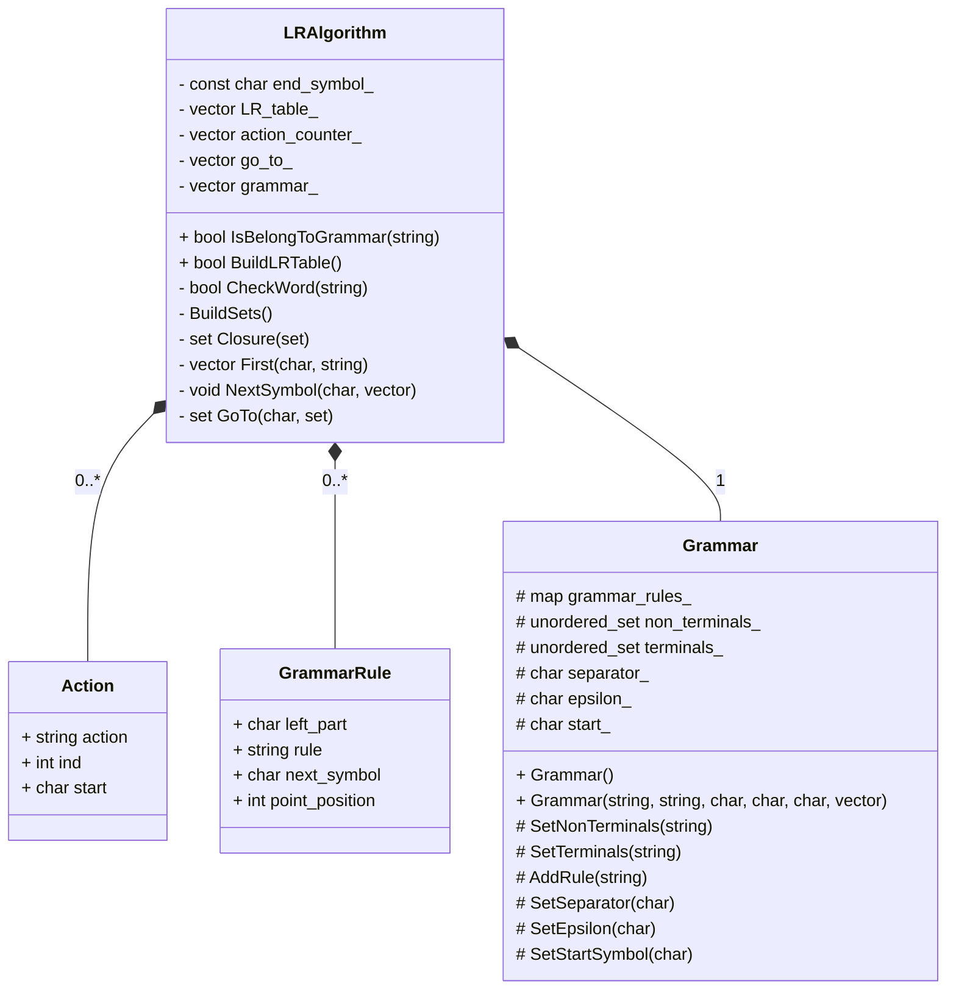

# LR-алгоритм разбора

Программа принимает файл с исходной грамматикой и отвечает на запросы о принадлежности слова грамматике.
Если грамматика не распознается алгоритмом, то программа также даст об этом знать.

### Сборка проекта:
1. Скачать репозиторий, перейти на ветку LR
2. Из папки репозитория в терминале выполнить _mkdir build && cd build && cmake -DCMAKE_BUILD_TYPE=Debug .. && make && make tests_
3. Для запуска тестов выполнить _../bin/Test_
4. Для запуска обработки из текстового файла выполнить _../bin/Main_

### Формат входных данных для текстового файла
Данные в файле находятся по строкам в следующем порядке:
1. Нетерминальные символы(через пробел или слитно)
2. Терминальные символы(через пробел или слитно)
3. Символ, разделяющий левую и правую часть правила грамматики
4. ε-символ
5. Стартовый символ

Примечание: среди символов не должны использоваться # и $.

Далее по одному в строке вводятся правила грамматики вида <левая часть правила><разделяющий символ><правая часть правила>.
Для того чтобы считать файл, необходимо поместить его в каталог репозитория "grammar" и ввести его название в терминал после запуска программы.
Если грамматика не подходит для LR-разбора, то программа сообщит об этом и завершится.
Если же подходит, то после этого можете построчно вводить слова, принадлежность к грамматике которых Вы хотите проверить. Для завершения работы введите _!exit!_ в терминал.

_Пример файла с входными данными:_

> S\
> ( )\
> ^\
> e\
> S\
> S^e\
> S^(S)S

Так же примеры входных файлов находятся в каталоге grammar репозитория.

_Покрытие строк тестами можно посмотреть в каталоге build/coverage/ в файле index.html._

### UML-диаграмма алгоритма:

